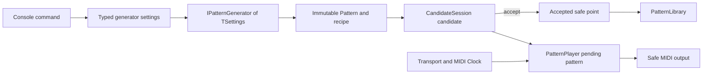

# Developer primer

JamWeaver separates reusable, device-independent MIDI behavior from terminal and
MIDI-library integration. Start here when changing the system, then follow the
links to the focused contract for the subsystem involved.

## Solution boundaries

- `JamWeaver.Core` owns validated musical values, patterns, generation,
  mutation, candidate state, playback, transport, MIDI safety, and persistence.
  It has no dependency on DryWetMIDI or console APIs.
- `JamWeaver.Console` owns composition, command parsing, port discovery, and
  DryWetMIDI adapters. It translates performer intent into strongly typed core
  operations.
- `JamWeaver.Core.Tests` exercises the core through deterministic inputs and
  fake MIDI ports. Hardware tests remain a separate validation activity.

Keep new musical rules and deterministic logic in the core. Keep device and
terminal details at the console boundary.

## Core pattern types

- `Pattern` is an immutable, materialized sequence. Playback trusts its steps,
  not its recipe.
- `PatternStep` holds the notes beginning at one sequencer position and the
  probability for that position.
- `PatternNote` holds a melodic or drum pitch, velocity, and gate.
- `PatternTiming` converts steps into MIDI Clock pulses. MIDI Clock is 24 PPQN.
- `TonalContext` supplies a root and pitch palette. Melodic patterns store scale
  degrees; `PentatonicPitchResolver` maps them into MIDI notes for a musical
  role at the playback boundary.
- `GeneratorRecipe` records generator identity, version, seed, optional parent,
  and validated parameter values. It explains and can reproduce generated
  material, but does not replace the materialized steps.

See [pattern model](../sequencer/pattern-model.md) for identity, editing, and
persistence invariants.

## Generation and performance flow

`IPatternGenerator<TSettings>` is the shared generation boundary. Its only
operation produces a `Pattern` from generator-specific, validated settings.
Settings remain strongly typed because phrase, groove, motif, melodic, and drum
controls are not interchangeable.

The console's generator-mode switch constructs the appropriate settings and
calls the corresponding implementation. There is deliberately no generic
registry: console controls and settings differ enough that explicit composition
is clearer and preserves type safety.

`CandidateSession` separates private audition from the accepted pattern.
Changing a candidate during playback schedules it at the next bar rather than
altering the audible bar in place. `CandidateHistory` supports local browsing.
Mutation is separate from generation because a mutator consumes a materialized
parent and records ancestry.

`PatternPlayer` schedules note events from the current pattern. Transport
determines musical position from internal or external clock. MIDI output safety
tracks active notes and performs deterministic cleanup on stop, disconnect, and
disposal.

See [candidate workflow](../performance/candidate-workflow.md), [clock and
transport](../midi/clock-transport.md), and [note lifecycle](../midi/note-lifecycle.md).

## Determinism and compatibility

Generation is reproducible for the same generator ID, version, settings, seed,
and parent material. Generators use `RandomDefaults.CreateRandomSource(seed)`;
random-call order is therefore part of the versioned output contract.

Each generator owns constant `GeneratorId` and `GeneratorVersion` values and
writes them into its recipe. `GeneratorRecipeReconstruction` strictly validates
identity, version, parameter names, types, ranges, and relationships before
recreating settings. Unsupported recipes remain playable from saved steps.

Change a generator version when an algorithm, dependency behavior, or random
call sequence changes fixed-seed output. Preserve snapshot tests for older
versions if the application must continue reconstructing their recipes.

See [pattern generation](../generation/pattern-generation.md) and [pattern
library](../persistence/pattern-library.md).

## Working on the code

Inspect the implementation as the source of truth before changing a contract.
Add deterministic tests for musical logic, validation, timing math, recipes,
and command parsing. Put hardware access behind core interfaces and never claim
hardware behavior from automated tests alone.

Build with `dotnet build JamWeaver.sln`. Run tests with
`dotnet run --project tests/JamWeaver.Core.Tests`.

To extend generation, follow [adding a generator](adding-a-generator.md).
