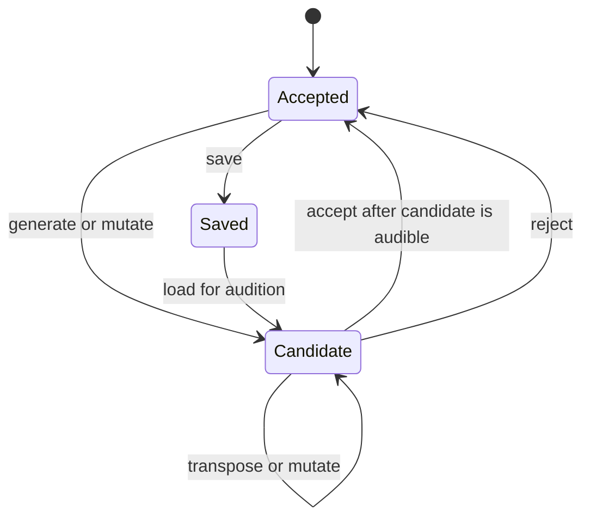

# Candidate workflow

The application is used as one contribution to an informal jam, not as a full
multi-track solo workstation. The performer monitors the synth through a small
mixer's headphone Aux channel while its main-mix level is down.

The application maintains:

- An accepted pattern, which is the single in-memory safe point and the only
  pattern eligible for saving.
- A candidate pattern, which can be generated, transposed, or mutated privately.
- An eight-entry list of recent candidate patterns for browsing.

The physical mixer determines what the room hears. The application does not
automate audio fades.

## Key finding by ear

Keys are not normally announced during these jams. The interface therefore does
not require the performer to type or understand a key name.

Key-finding mode privately auditions the candidate while controls move through
the 12 chromatic roots and the major/minor pentatonic palettes. The display may
show a conventional name such as `D minor pentatonic`, but selection is by ear.
An accepted root/palette change preserves the pattern's scale-degree shape.

The terminal's default help presents performance-oriented controls:

- `go` and `stop` start or stop the performance. `go` enables pattern output and
  starts internal transport when necessary; with external clock it waits for
  MIDI Start or Continue.
- `new`, `vary`, `revert`, and `keep` generate, mutate, reject, and accept using
  performer-facing language.
- `back` and `forward` browse the recent candidate list.
- Transpose down/up one semitone.
- Move between bass, middle, and high roles.
- Save accepted patterns and load saved patterns for audition.
- Panic/All Notes Off.

The prompt summarizes transport, note-output, generator, and candidate state.
Device, clock, raw MIDI, generator-detail, and comparison controls are
discoverable through `help advanced` rather than competing with the default
live workflow. The performer-facing commands are canonical; redundant former
aliases such as `generate`, `mutate`, `previous`, `accept`, and `root` are not
part of the interface.

Essential device selection is not treated as advanced. Startup points to
`setup`, which shows current configuration, enumerates ports, and gives concrete
`out <number>` and `in <number>` commands. Those short commands are also shown
in default help. Invoking either without a number lists the relevant ports and
its selection syntax, so setup can be discovered without already knowing the
command vocabulary. Clock selection follows the same contract: `setup` and
default help show `source internal|external` and `bpm <20..300>`, while either
bare command reports its current value and valid syntax. MIDI channel routing is
also essential setup: `setup` shows the current user-facing channel, default
help shows the concise `ch <1..16>` form, and bare `ch` or `channel` reports its
value and syntax. `channel` remains the readable long form of this conventional
MIDI abbreviation.

Musical creation controls are part of default help rather than diagnostics.
Bare `generator` reports the current generator and the motif, phrase, groove,
and simple choices. Bare `shape` reports the current motif shape and all shape
choices. Both show their selection syntax, and setting either confirms the new
value. `generator` also lists the controls relevant to its selected mode.
`shape` is explicitly motif-only; under another generator it reports that the
retained selection is inactive rather than implying that it affects `new`.

`vary` treats strength as the ordinary optional argument: `vary 0.7` uses a
fresh seed at strength 0.7, while bare `vary` uses a fresh seed at the 0.3
default. Targeted forms place the target first, such as `vary rhythm 0.5`.
Reproducibility is deliberately explicit through a named suffix, for example
`vary 0.7 seed 123`.

Playback-affecting changes made while running become active on the next bar.
When stopped, candidate editing can apply immediately because nothing is being
sent. Pattern acceptance and saving are separate: acceptance moves the
in-memory safe point; saving persists it for another session.

Manual MIDI recording and graphical interfaces are outside the current scope.
The engine remains independent of the terminal UI.

`play` and `mute` enable or silence pattern notes without changing the shared
transport. Acceptance is immediate bookkeeping once the candidate is audible;
it is refused while that candidate is still pending. Reject selects Accepted
again without removing anything from the recent-pattern list.

The eight-entry recent-pattern list supports `back` and `forward`. Navigating
queues the selected pattern through the normal stopped-immediate or
running-next-bar path. Creating a candidate after navigating backward discards
the forward branch; this never alters Accepted. Accepting a pattern does not
create a second history: the former safe point is recoverable only while it
remains in this bounded list or if it was saved.

Only Accepted can be saved. `save [name]` confirms the saved musical name and
shows its matching `load <name>` command; generated filenames and storage paths
are not part of the ordinary workflow. Load always enters as Candidate and
follows the same immediate-while-stopped or next-bar-while-running audition
path. An optional save name updates matching in-memory metadata only after the
atomic file save succeeds.

`load <name>` matches saved names case-insensitively and supports spaces. Library
numbers remain an explicit disambiguation mechanism through `load #<number>`;
a bare number is also accepted when it does not match a saved name. Duplicate
names produce the applicable numbered choices instead of choosing silently.
Bare `load` lists the available patterns and teaches both selection forms.

Related: [pattern model](../sequencer/pattern-model.md),
[pattern generation](../generation/pattern-generation.md), and
[clock and transport](../midi/clock-transport.md).
