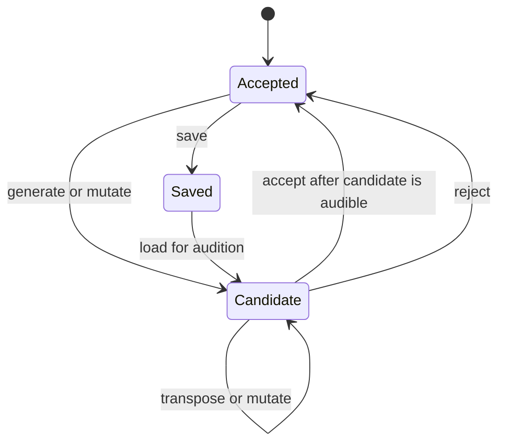

# Candidate workflow

The application is used as one contribution to an informal jam, not as a full
multi-track solo workstation. The performer monitors the synth through a small
mixer's headphone Aux channel while its main-mix level is down.

The application maintains:

- An accepted pattern, which is the single in-memory safe point and the only
  pattern eligible for saving.
- A candidate pattern, which can be generated, transposed, or mutated privately.
- An eight-entry list of recent candidate patterns for browsing.

The physical mixer determines what the room hears. The application does not
automate audio fades.

## Key finding by ear

Keys are not normally announced during these jams. The interface therefore does
not require the performer to type or understand a key name.

Key-finding mode privately auditions the candidate while controls move through
the 12 chromatic roots and the major/minor pentatonic palettes. The display may
show a conventional name such as `D minor pentatonic`, but selection is by ear.
An accepted root/palette change preserves the pattern's scale-degree shape.

The terminal provides direct controls for:

- Start and stop candidate playback.
- Generate, mutate, reject, and accept.
- Transpose down/up one semitone.
- Move between bass, middle, and high roles.
- Save accepted patterns and load saved patterns for audition.
- Panic/All Notes Off.

Playback-affecting changes made while running become active on the next bar.
When stopped, candidate editing can apply immediately because nothing is being
sent. Pattern acceptance and saving are separate: acceptance moves the
in-memory safe point; saving persists it for another session.

Manual MIDI recording and graphical interfaces are outside the current scope.
The engine remains independent of the terminal UI.

`play` and `mute` enable or silence pattern notes without changing the shared
transport. Acceptance is immediate bookkeeping once the candidate is audible;
it is refused while that candidate is still pending. Reject selects Accepted
again without removing anything from the recent-pattern list.

The eight-entry recent-pattern list supports `previous` and `next`. Navigating
queues the selected pattern through the normal stopped-immediate or
running-next-bar path. Creating a candidate after navigating backward discards
the forward branch; this never alters Accepted. Accepting a pattern does not
create a second history: the former safe point is recoverable only while it
remains in this bounded list or if it was saved.

Only Accepted can be saved. Load always enters as Candidate and follows the
same immediate-while-stopped or next-bar-while-running audition path. An
optional save name updates matching in-memory metadata only after the atomic
file save succeeds.

Related: [pattern model](../sequencer/pattern-model.md),
[pattern generation](../generation/pattern-generation.md), and
[clock and transport](../midi/clock-transport.md).
