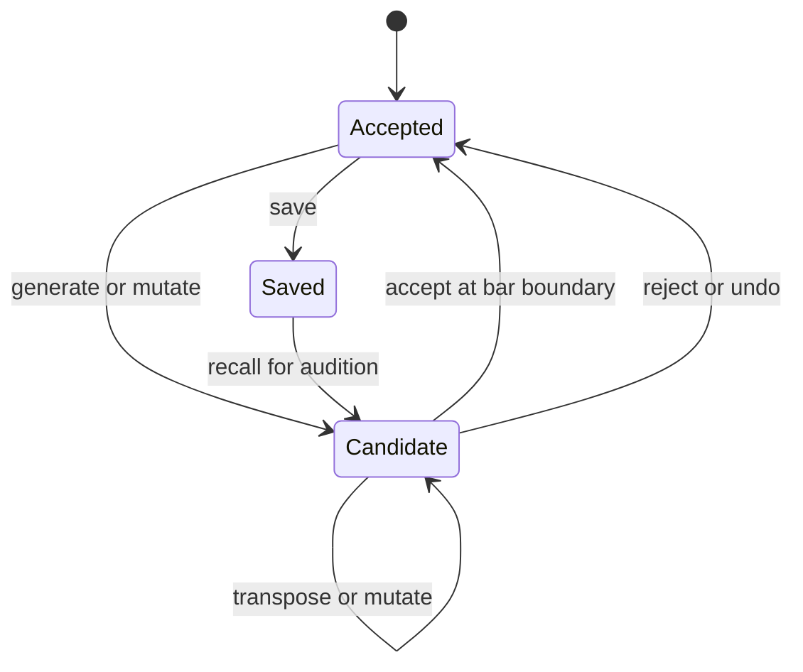

# Candidate workflow

> Design status: implemented for the line-oriented console and covered by
> automated core tests, including save and recall.

The application is used as one contribution to an informal jam, not as a full
multi-track solo workstation. The performer monitors the synth through a small
mixer's headphone Aux channel while its main-mix level is down.

The application maintains:

- An accepted pattern, which is the safe point for recall and undo.
- A candidate pattern, which can be generated, transposed, or mutated privately.
- One previous accepted pattern for undo toggling.

The physical mixer determines what the room hears. The application does not
automate audio fades.

## Key finding by ear

Keys are not normally announced during these jams. The interface therefore does
not require the performer to type or understand a key name.

Key-finding mode privately auditions the candidate while controls move through
the 12 chromatic roots and the major/minor pentatonic palettes. The display may
show a conventional name such as `D minor pentatonic`, but selection is by ear.
An accepted root/palette change preserves the pattern's scale-degree shape.

The first terminal interface should prioritize direct controls for:

- Start and stop candidate playback.
- Generate, mutate, undo/reject, and accept.
- Transpose down/up one semitone.
- Move between bass, middle, and high roles.
- Save and recall accepted patterns.
- Panic/All Notes Off.

Playback-affecting changes made while running become active on the next bar.
When stopped, candidate editing can apply immediately because nothing is being
sent. Pattern acceptance and saving are separate: acceptance establishes the
undo point; saving persists it for another session.

Manual MIDI recording and browser UI are outside the initial scope. The console
is the first UI, while the engine remains independent so an Avalonia interface
can replace it later without rewriting generation or scheduling.

`play` and `mute` enable or silence pattern notes without changing the shared
transport. Acceptance is immediate bookkeeping once the candidate is audible;
it is refused while that candidate is still pending. Reject returns to Accepted,
and undo swaps Accepted with the one previous accepted snapshot.

An independent eight-entry candidate history supports `previous` and `next`.
Navigating queues the selected snapshot through the normal stopped-immediate or
running-next-bar path. Creating a candidate after navigating backward discards
the forward history branch; this never alters Accepted or its undo slot.

Only Accepted can be saved. Recall always enters as Candidate and follows the
same immediate-while-stopped or next-bar-while-running audition path. An
optional save name updates matching in-memory metadata only after the atomic
file save succeeds.

Related: [pattern model](../sequencer/pattern-model.md),
[pattern generation](../generation/pattern-generation.md), and
[clock and transport](../midi/clock-transport.md).
