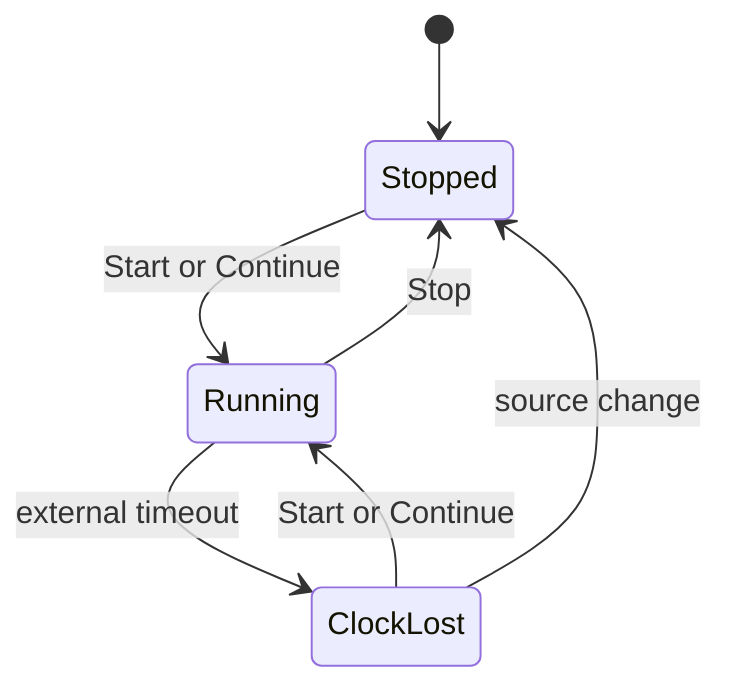

# Stage 4: transport state and quantized scheduling

> Status: implemented and covered by the xUnit suite.

Stage 4 gives internal and external MIDI Clock a shared transport state,
position, step/bar boundary model, clock-loss behavior, and atomic bar-quantized
swap primitive. It does not play pattern notes; Stage 5 consumes these timing
events to implement candidate playback.

## Source structure

```text
src/JamWeaver.Core/Transport/
  TransportEngine.cs
  SequencerTimeline.cs
  ExternalClockWatchdog.cs
  InternalMidiClock.cs
  BarQuantizedSwap.cs
```

The source/state/position types live with `TransportEngine`. Existing external
event classification and DryWetMIDI adapters remain. Tests use fake monotonic
time, an injected pulse scheduler, and fake MIDI output.

## State model

`TransportEngine` is the single authority for:

- `ClockSource`: `External` or `Internal`.
- `TransportState`: `Stopped`, `Running`, or `ClockLost`.
- Monotonic pulse position since the last Start.
- The timestamp of the last accepted external clock pulse.

State transitions are:



`Start` resets pulse position to zero and enters Running. `Continue` preserves
position and enters Running. `Stop` preserves position and enters Stopped.
Clock loss preserves position, enters ClockLost, and never switches sources.

Clock pulses advance position only while Running. Pulses received while Stopped
or ClockLost are ignored. After clock loss, a new Start or Continue is required;
the mere return of pulses does not resume playback.

Duplicate Start while Running is accepted and resets position, matching MIDI
transport semantics. Duplicate Continue while Running and duplicate Stop while
stopped are idempotent.

## Position and boundaries

`TransportPosition` uses an unsigned 64-bit pulse count. At 24 PPQN in 4/4:

- Pulse-in-quarter-note is `pulse % 24`.
- Beat is `(pulse / 24) % 4`.
- Pulse-in-bar is `pulse % 96`.
- Bar is `pulse / 96`.

The first accepted Clock after Start is pulse position zero. Boundary events are
reported before incrementing to the next pulse:

- Position 0: bar 0, beat 0, and step 0 boundaries.
- Position 6 at sixteenth resolution: step 1.
- Position 96: bar 1 and step 0 for a 16-step pattern.

The pulse counter uses checked increment rather than wrapping. Its practical
maximum duration is unreachable in normal use.

## Sequencer timeline

`SequencerTimeline` combines transport pulses with a `PatternTiming` and pattern
step count. For each accepted pulse it reports a compact immutable boundary value
containing:

- Current transport position.
- Whether this is a beat boundary.
- Whether this is a bar boundary.
- Optional pattern step index when this is a step boundary.

Pattern loops and bars are independent. A 12-step sixteenth pattern loops after
72 pulses, while bar boundaries remain every 96 pulses. Replacing timeline
configuration is allowed only through an atomic prepared value; the timing path
does not allocate, block, persist, or perform console output.

Stage 4 exposes synchronous boundary observation intended for short engine work.
Slow UI/logging consumers receive copied notifications through a separate queue
owned by the host; they do not run on the timing path.

## External clock

The external adapter forwards Start, Continue, Stop, and Clock to
`TransportEngine` only when External is selected. Messages are observed but not
relayed to any MIDI output.

Each accepted running Clock refreshes a monotonic deadline. A watchdog checks the
deadline independently so total clock disappearance is detected without another
MIDI event. The proposed default timeout is 500 ms and is configurable from
100-5000 ms.

The engine uses injected monotonic time, making timeout logic deterministic in
tests; the watchdog supplies independent polling and cancellation. A race
between a pulse and timeout is serialized by the transport engine lock;
whichever obtains the lock first establishes the next state.

External BPM estimation is diagnostic only. Stage 4 may retain a smoothed status
value, but tempo estimation never drives step/bar position or automatic internal
fallback.

## Internal clock

Internal mode drives the same `TransportEngine` while also sending MIDI Start,
Continue, Stop, and Clock to the selected output. For each operation, the MIDI
message is sent first and the corresponding local state/tick is applied
immediately afterward.

The internal loop uses an absolute-deadline scheduler based on `Stopwatch`: a
cancellable coarse delay followed by a short spin wait. Each
deadline is based on the intended previous deadline, not completion time, so
individual late pulses do not permanently drift the tempo.

Tempo remains 20-300 BPM and can change while running. The new value affects the
next interval without resetting transport position. Internal timing is a desktop
software fallback, not hard real-time; Stage 7 must measure it before performance
claims are made.

Tests use an injected scheduler and never assert wall-clock sleeps. The existing
24-pulse-per-quarter contract and Start/Continue/Stop ordering remain covered.

## Source switching

Changing source is explicit and thread-safe. The proposed behavior is:

1. Stop the currently running source.
2. Preserve pulse position.
3. Select the new source and enter Stopped.
4. Require explicit Start or Continue; never auto-resume.

Switching away from Internal sends MIDI Stop if it was running. Switching away
from External does not relay anything. Stage 5 will silence active pattern notes
when transport leaves Running.

## Bar-quantized swaps

`BarQuantizedSwap<T>` holds a current value and at most one pending value:

- Queue while stopped: the value becomes current immediately.
- Queue while running: it replaces any previous pending value.
- At the next strictly future bar boundary: pending atomically becomes current.
- Cancel removes the pending value without changing current.

“Strictly future” means a value queued by work responding to a bar boundary waits
until the following bar. This prevents callback ordering from changing whether a
swap is immediate.

The swap primitive performs only field exchange under a short lock. It does not
invoke arbitrary callbacks on the timing thread. Stage 5 reads the activated
value and handles candidate/accepted semantics.

## Errors and shutdown

Transport failures carry source, state, and operation context. They are reported
outside timing callbacks. Device send failure stops Internal transport; it does
not continue a local timeline that attached hardware cannot follow.

Disposal cancels and waits for the internal scheduler and watchdog tasks. The
host explicitly stops transport during source changes; Stage 5 adds active-note
cleanup through `SafeMidiOutput`.

## xUnit verification

The Stage 4 xUnit tests cover the core contracts, including:

- State transitions, ignored pulses, Start reset, and Continue preservation.
- Exact step, beat, bar, loop, and non-bar-aligned pattern boundaries.
- External messages ignored while Internal is selected and vice versa.
- Timeout immediately before and at the deadline using fake monotonic time.
- No automatic recovery or fallback after clock loss.
- Source switching while running.
- Internal MIDI/local ordering and 24 PPQN using an injected scheduler.
- Quantized immediate, replacement, and strictly-future swaps.

No test requires a MIDI device or real elapsed-time wait.

## Explicitly deferred

- Resolving pattern pitches and sending Note On/Off at step/gate boundaries.
- Candidate/accepted state, undo, key finding, and terminal performance controls.
- MIDI Song Position Pointer, time signatures other than 4/4, and clock relay.
- Swing, MIDI Clock jitter correction, and hard-real-time guarantees.

## Resolved decisions

- External clock timeout defaults to a configurable 500 ms.
- Source switching stops, preserves position, and requires explicit Start or
  Continue.
- Queued values apply immediately while stopped; while running, the latest
  pending value activates at the next strictly future bar.

Related: [clock and transport](../midi/clock-transport.md),
[candidate workflow](../performance/candidate-workflow.md), and the
[initial sequencer plan](initial-sequencer.md).
